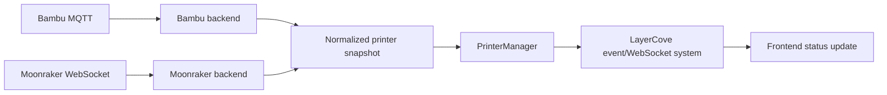
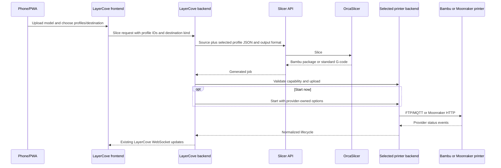

# ADR 0001: Multi-backend printer architecture

**Status:** Proposed

**Date:** 2026-07-11

## Context

LayerCove inherits a mature Bambu implementation whose manager, MQTT state,
FTP dispatch, scheduler, archive lifecycle, API, and frontend are tightly
connected. Adding Moonraker with conditionals at each call site would duplicate
policy, leak credentials and protocols, and make upstream updates hazardous.

## Decision

Keep `PrinterManager` as the application-facing façade. It owns registered
`PrinterBackend` instances selected by persisted provider. A backend owns its
connection lifecycle, status normalization, upload/start transport, common
commands, capabilities, and provider-specific detail.

The first implementation adapts current Bambu services; it does not rewrite
them. The second implementation uses Moonraker HTTP for queries, file upload,
and commands, and Moonraker WebSocket subscriptions for live state.

Generic application behavior consumes:

- a normalized printer snapshot;
- the minimal capability set listed in the audit;
- typed upload and start results/options;
- provider-neutral lifecycle events.

Bambu-only endpoints and panels may depend on a typed Bambu adapter. Generic
code must not obtain `BambuMQTTClient` or branch repeatedly on provider names.

## Persistence

Add a non-null provider column defaulting existing and new legacy rows to
`bambu`. Keep Bambu serial/access fields and identifiers intact. Store
Moonraker configuration in a focused provider configuration model or focused
nullable columns after migration design proves which is smaller. Credentials
use existing encryption and secret-aware response rules.

## Normalized state

Common states are `offline`, `connecting`, `idle`, `preparing`, `printing`,
`paused`, `complete`, `cancelled`, `error`, and `unknown`. Snapshot fields cover
connection, message, current filename, progress, elapsed/remaining time,
layers, common temperatures, and opaque provider detail. Bambu `PrinterState`
continues to exist behind the adapter so inherited behavior is not flattened.

## Event flow

Backend reconnect is bounded exponential backoff with jitter and one active
connection task per printer. Initial state comes from provider query; live
changes come from subscriptions. No tight polling loop is permitted.

## Slice and dispatch flow

Bambu keeps `.3mf`/`.gcode.3mf`, plate, AMS, calibration, queue, and archive
behavior. Moonraker accepts sanitized `.gcode` in its `gcodes` root and never
receives Bambu-only start options.

## Queue and history

Queue selection, lifecycle transitions, notifications, history, and archive
policy remain application services. Upload, start, cancellation, and state
interpretation move behind the backend seam. Provider-specific metadata is
preserved without forcing Moonraker into Bambu fields.

## Frontend

API responses include provider and capabilities. Shared status, progress,
temperature, camera, and common controls render from capabilities. AMS, plate,
firmware, and Moonraker-only controls are focused panels. Emergency stop always
requires explicit confirmation.

## Security

LayerCove is the browser trust boundary. Provider credentials never return in
normal API responses or logs. Moonraker URLs are administrator-configured and
validated against SSRF/redirect abuse. TLS verification defaults on and is
scoped per printer. Upload names reject traversal. No arbitrary shell, generic
G-code execution endpoint, or Moonraker proxy is introduced.

## Rejected alternatives

- **Scattered provider checks:** easy initially, but duplicates transport and
  capability policy across already-large files.
- **Rewrite Bambu as a pure new backend:** high regression and upstream-conflict
  risk with no current product benefit.
- **Separate complete frontend per provider:** duplicates shared farm workflow
  and makes mobile behavior drift.
- **Generic command/G-code endpoint:** broad, unsafe, and outside MVP.
- **Moonraker polling as primary status:** wasteful and weaker than supported
  subscriptions.

## Consequences

Foundation work must first add characterization coverage. Some Bambu-specific
routes will remain intentionally separate. `PrinterManager` temporarily bridges
legacy and normalized responses while callers migrate. This staged adapter
cost is accepted to keep Bambu compatibility and upstream sync practical.

