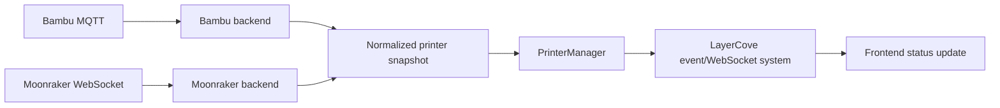
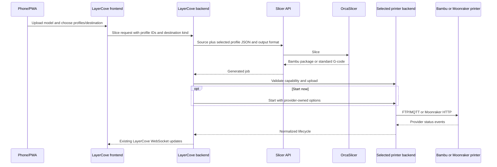

# ADR 0001: Multi-backend printer architecture

**Status:** Accepted

**Date:** 2026-07-11

**Reviewed by:** `/root/review_adr` independent architecture-review subagent

**Accepted:** 2026-07-11

**Tracking:** [LayerCove epic #1](https://github.com/Timpan4/layercove/issues/1),
[architecture acceptance #2](https://github.com/Timpan4/layercove/issues/2)

## Context

LayerCove inherits a mature Bambu implementation whose manager, MQTT state,
FTP dispatch, scheduler, archive lifecycle, API, and frontend are tightly
connected. Adding Moonraker with conditionals at each call site would duplicate
policy, leak credentials and protocols, and make upstream updates hazardous.

## Decision

Keep `PrinterManager` as the application-facing façade. It owns registered
`PrinterBackend` instances selected by persisted provider. A backend owns its
connection lifecycle, status normalization, upload/start transport, common
commands, capabilities, and provider-specific detail.

The first implementation adapts current Bambu services; it does not rewrite
them. The second implementation uses Moonraker HTTP for queries, file upload,
and commands, and Moonraker WebSocket subscriptions for live state.

Generic application behavior consumes:

- a normalized printer snapshot;
- the minimal capability set listed in the audit;
- typed upload and start results/options;
- provider-neutral lifecycle events.

Bambu-only endpoints, routes, and integration services may temporarily depend
on a typed Bambu adapter. Generic code must not obtain `BambuMQTTClient` or
branch repeatedly on provider names. Every existing `get_client()` consumer is
classified before implementation as generic, Bambu-only, or obsolete; only the
Bambu-only group may use the typed adapter escape hatch.

### Backend contract

All provider I/O is asynchronous. The implementation uses equivalent
repository-native dataclasses/enums and this minimal shape:

```python
class PrinterBackend(Protocol):
    provider: PrinterProvider

    @property
    def capabilities(self) -> PrinterCapabilities: ...

    async def connect(self) -> None: ...
    async def disconnect(self) -> None: ...
    def snapshot(self) -> PrinterSnapshot: ...
    async def upload_job(self, job: UploadJob) -> UploadResult: ...
    async def start_job(self, job: StartJob) -> StartResult: ...
    async def pause(self) -> None: ...
    async def resume(self) -> None: ...
    async def cancel(self) -> None: ...
    async def emergency_stop(self) -> None: ...
```

`PrinterManager` passes each backend one non-blocking
`emit(event: BackendEvent) -> None` sink at construction. The sink may be called
from a transport thread; the adapter must marshal it with
`loop.call_soon_threadsafe`. The manager puts events on one `asyncio.Queue` per
printer and one consumer forwards them in FIFO order. Provider tasks never call
application callbacks directly. `disconnect()` stops provider producers and
returns only when no later sink call is possible; the manager then drains the
queue before stopping its consumer. Forced process shutdown may cancel the
drain after the existing shutdown timeout, but normal disconnect cannot reorder
or drop accepted events.

`UploadJob` contains local `Path`, sanitized remote basename, artifact kind,
size, application job ID, and a read-only cancellation token. Backends emit
`UploadProgress(application_job_id, bytes_sent, total_bytes)` through the same
event sink. The manager maps this event to the existing scheduler/WebSocket
progress bridge. A cancelled token stops transfer at the next safe chunk,
performs provider-specific best-effort partial-file cleanup, and raises
`BackendError("upload_cancelled", ..., retryable=False)`; a cancelled upload is
never started. `UploadResult` contains remote basename and bytes uploaded.
`StartJob` is a discriminated union of `BambuStartJob` and
`MoonrakerStartJob`; Bambu options retain plate, AMS, calibration, timelapse,
and nozzle fields, while Moonraker has no Bambu option fields. Each backend
rejects a mismatched variant before network I/O. `StartResult` contains the
mandatory backend correlation ID used for later lifecycle events.

Backends raise `BackendError(code, safe_message, retryable)` for expected
failures. Codes are stable application values; messages contain no credentials
or raw response bodies. Boolean success values remain only in the temporary
Bambu compatibility façade. `PrinterManager` translates backend results into
legacy booleans while old Bambu callers migrate. New generic code consumes the
typed result/error contract.

## Persistence

Add `printers.provider`, a non-null `VARCHAR(20)` with database and application
default `bambu`. Existing rows are backfilled to `bambu`. Keep existing column
names, indexes, relationships, and values, but make `serial_number`,
`ip_address`, and `access_code` nullable. A Bambu create/update schema still
requires all three. A Moonraker row leaves them null; its stable LayerCove
identity is `printers.id`, not a fabricated serial number. Multiple null values
remain valid under the existing unique serial constraint.

Add one focused `moonraker_printer_configs` row per Moonraker printer:

- `printer_id`: primary key and cascading foreign key to `printers.id`;
- `base_url`: required normalized HTTP(S) origin;
- `websocket_url_override`: nullable normalized WS(S) URL;
- `api_key_ciphertext`: nullable encrypted secret;
- `authorization_ciphertext`: nullable encrypted authorization value;
- `tls_verify`: non-null, default true.

At most one authentication field may be populated. Existing generic camera and
snapshot columns remain on `printers`; optional descriptive model remains
`printers.model`. Bambu rows must not have a Moonraker config row; Moonraker
rows must have one. Pydantic/service validation enforces these invariants for
both dialects. Fresh databases also receive database check/foreign-key
constraints where the existing framework supports them.

The startup migration rebuilds the SQLite `printers` table to relax the three
legacy `NOT NULL` constraints while preserving rows, indexes, relationships,
and foreign-key targets. PostgreSQL uses `ALTER COLUMN ... DROP NOT NULL`.
Migration tests cover representative Bambu data, foreign-key relationships,
rerun/startup idempotency, and recovery from an interrupted SQLite rebuild.
The migration never changes the final table name or drops existing Bambu values.

Migration recovery is automatic. SQLite creates `printers_provider_new`, checks
that its row count matches `printers`, then swaps tables in the startup
transaction and recreates explicit indexes. A stale temporary table is removed
only while the authoritative `printers` table still exists. Transaction rollback
restores the original table if startup stops after the swap begins. Operators
restore the database backup if either row-count verification or transaction
rollback fails; the migration does not guess which partial table is authoritative.
If foreign-key enforcement was enabled outside LayerCove's SQLite connection
setup, startup stops before the rebuild instead of risking `ON DELETE` cascades.

Existing identifiers remain unchanged: table and column names, printer IDs,
Bambu serial numbers, archive foreign keys, API paths, data directories, and
environment names. `MFA_ENCRYPTION_KEY` and `.mfa_encryption_key` remain aliases
for compatibility; the LayerCove environment name is preferred for new setups.

### Secrets

Moonraker credentials use a generalized application-secret wrapper over the
current Fernet key material. Key resolution is exact:

1. If both `LAYERCOVE_SECRET_ENCRYPTION_KEY` and `MFA_ENCRYPTION_KEY` are set,
   both must be valid and byte-identical; different or invalid values fail
   closed and no encrypted secret is read or written.
2. Otherwise the one configured environment key is used. An invalid preferred
   LayerCove key fails closed. The legacy MFA-only invalid-key behavior remains
   compatible and may fall through to the existing key file.
3. With no usable environment key, read the existing
   `DATA_DIR/.mfa_encryption_key` file.
4. Only when no key file exists, generate and persist that same legacy-named
   file using the current exclusive-create and permission checks.

No second key file is introduced. Existing encrypted MFA/OIDC rows therefore
keep working. Precedence, same-value aliases, conflict failure, invalid values,
file fallback, and key generation are tested.

Moonraker writes fail closed when no valid persistent Fernet key is available;
plaintext fallback is forbidden for these two columns. Existing MFA/OIDC
plaintext compatibility and Bambu access-code storage do not change in this
phase. If the key is lost or unreadable, LayerCove does not regenerate or
overwrite it: Moonraker connections stay disabled with a safe operator error
until the key is restored or the credential is re-entered. API responses expose
only `api_key_configured` and `authorization_configured`; they never return a
stored Moonraker secret, including to privileged users. Existing permission-
gated Bambu access-code responses remain compatible pending a separate tested
migration.

## Normalized state

Common states are `offline`, `connecting`, `idle`, `preparing`, `printing`,
`paused`, `completed`, `cancelled`, `error`, and `unknown`. Snapshot fields cover
connection, message, current filename, progress, elapsed/remaining time,
layers, common temperatures, and opaque provider detail. Bambu `PrinterState`
continues to exist behind the adapter so inherited behavior is not flattened.

Provider detail is server-internal by default. Any API-visible provider detail
uses an adapter-owned allowlist schema; raw MQTT or Moonraker payloads never
cross the normal printer API/WebSocket boundary.

## Event flow



Backend reconnect is bounded exponential backoff at 1, 2, 4, 8, 16, then 30
seconds, with 0-20% positive jitter. A successful subscribed connection stable
for 30 seconds resets the sequence. One owned connection task exists per
printer; disconnect/shutdown cancels and awaits it. Initial state comes from a
provider query; live changes come from subscriptions. No tight polling loop is
permitted.

## Lifecycle event ownership

Provider backends alone interpret protocol payloads and emit three typed events:
`StatusChanged(snapshot)`, `UploadProgress(...)`, and
`JobLifecycle(kind, correlation_id, provider_job_id, filename,
occurred_at, reason)`. Lifecycle kinds are `started`, `completed`, `failed`, and
`cancelled`. `PrinterManager` is the only component that forwards these events
to application callbacks and the LayerCove WebSocket system.

`correlation_id` is always non-null and stable from start through the terminal
event. LayerCove-dispatched jobs use the application job ID plus provider. When
a provider exposes its own stable ID, that value is also retained as
`provider_job_id`. For an external Bambu job without a subtask ID, the adapter
creates a UUID at the first observed active edge and retains it until terminal.
For a Moonraker job without history ID, the adapter creates the same kind of
backend-owned generation at the first non-active-to-active transition. A
reconnect reuses the active correlation; it never creates a new one solely from
an idle or terminal bootstrap snapshot. An active bootstrap snapshot may create
a correlation when no provider/application ID exists, marking the job as
observed-running without emitting a synthetic `started` event. A later terminal
transition uses that correlation. This preserves completion handling for a
Bambu or Moonraker print already running when LayerCove restarts.

The Bambu adapter forwards the existing Bambu start/completion callbacks and
their `_was_running`/`_completion_triggered` guards; it does not independently
re-derive edges from normalized state. Moonraker prefers the stable job ID from
Moonraker history events. When history is unavailable, it uses a backend-owned
generation keyed by filename plus the observed non-active-to-active transition;
that generation survives WebSocket reconnects for the life of the backend.

`PrinterManager` deduplicates `(printer_id, correlation_id, kind)` for the
process lifetime. Queue/history/archive handlers additionally perform terminal
state changes in a database transaction only when the correlated queue/archive
record is not already terminal. An already-terminal bootstrap snapshot never
emits a terminal event. A later terminal transition may emit only when
LayerCove observed the job active, including through active bootstrap, or an
active queue record supplies the correlation. This prevents duplicate or ghost
archives after reconnect/restart while retaining existing Bambu behavior.

Queue-item cancellation and active-printer cancellation remain separate
application operations. Cancelling a queued item does not call the printer;
cancel on an active correlated item invokes the backend and then awaits its
terminal lifecycle event.

## Slice and dispatch flow



Bambu keeps `.3mf`/`.gcode.3mf`, plate, AMS, calibration, queue, and archive
behavior. Moonraker accepts sanitized `.gcode` in its `gcodes` root and never
receives Bambu-only start options.

## Queue and history

Queue selection, lifecycle transitions, notifications, history, and archive
policy remain application services. Upload, start, cancellation, and state
interpretation move behind the backend seam. Provider-specific metadata is
preserved without forcing Moonraker into Bambu fields.

## Frontend

API responses include provider and capabilities. Shared status, progress,
temperature, camera, and common controls render from capabilities. AMS, plate,
firmware, and Moonraker-only controls are focused panels. Emergency stop always
requires explicit confirmation.

## Security

LayerCove is the browser trust boundary. Provider credentials never return in
normal API responses or logs. Moonraker URLs are administrator-configured and
validated against SSRF/redirect abuse. TLS verification defaults on and is
scoped per printer. Upload names reject traversal. No arbitrary shell, generic
G-code execution endpoint, or Moonraker proxy is introduced.

Configured Moonraker targets may be private/LAN addresses because that is the
product purpose. Link-local metadata, multicast, unspecified, and loopback
targets are blocked unless an explicit narrowly scoped local-development mode
is active. Redirects are disabled. Hostname resolution is validated before
connect and the connected peer must match the approved resolution set; request-
time browser URL overrides are forbidden. The same policy applies to HTTP,
WebSocket, camera snapshots fetched by LayerCove, and connection tests.

## Rejected alternatives

- **Scattered provider checks:** easy initially, but duplicates transport and
  capability policy across already-large files.
- **Rewrite Bambu as a pure new backend:** high regression and upstream-conflict
  risk with no current product benefit.
- **Separate complete frontend per provider:** duplicates shared farm workflow
  and makes mobile behavior drift.
- **Generic command/G-code endpoint:** broad, unsafe, and outside MVP.
- **Moonraker polling as primary status:** wasteful and weaker than supported
  subscriptions.

## Consequences

Foundation work must first add characterization coverage. Some Bambu-specific
routes will remain intentionally separate. `PrinterManager` temporarily bridges
legacy and normalized responses while callers migrate. This staged adapter
cost is accepted to keep Bambu compatibility and upstream sync practical.
