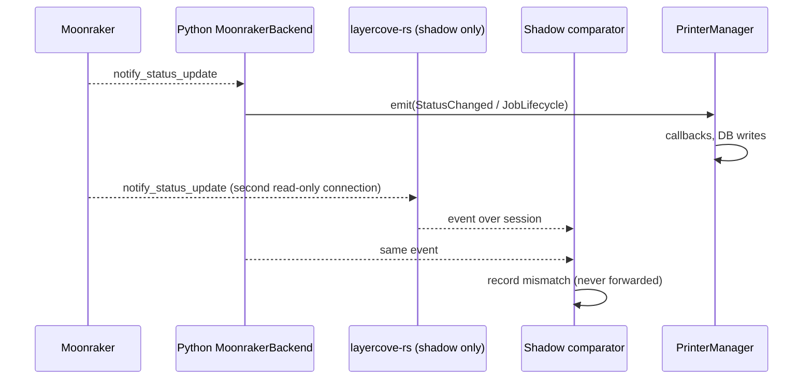
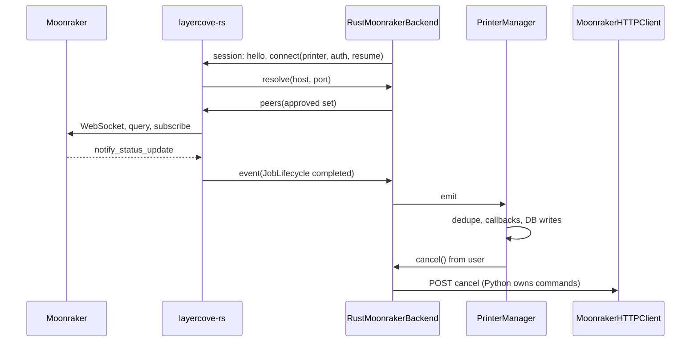
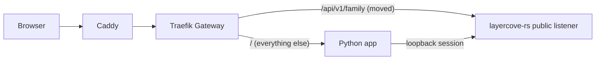

# ADR 0002: Python/Rust coexistence and Moonraker status pilot

**Status:** Accepted

**Date:** 2026-09-25

**Accepted:** 2026-09-25, by the repository owner merging
[#155](https://github.com/Timpan4/layercove/pull/155)

**Tracking:** [coexistence boundary #103](https://github.com/Timpan4/layercove/issues/103),
[migration epic #112](https://github.com/Timpan4/layercove/issues/112),
[Rust service #106](https://github.com/Timpan4/layercove/issues/106),
[printer provider transfer #109](https://github.com/Timpan4/layercove/issues/109)

## Context

The owner wants to move backend capabilities to Rust gradually while Python
keeps serving the product. The Rust side must be its own application with its
own HTTP API, so API families can move to it one at a time. Two runtimes that
both hold printer connections, scheduler tasks, or database writes can
duplicate physical commands and lifecycle effects. ADR 0001 defines the
provider boundary (`PrinterManager` façade, `PrinterBackend` per provider, one
event sink, FIFO lifecycle delivery). It does not say which runtime owns a
capability.

The owner runs LayerCove on the `wall-e` Kubernetes cluster (`wall-e-infra`
repository, `apps/layercove`):

- One `layercove` Deployment, `replicas: 1`, `strategy: Recreate`, with the
  `app` container and a `tailscale` sidecar.
- Printers are reachable only through that sidecar: kernel-mode Tailscale,
  `tag:layercove`, accepted routes, and camera MSS rules.
- Public traffic goes through Caddy to the Traefik Gateway, where an
  `HTTPRoute` for `layercove.timpan.dev` sends `/` to Service `layercove:80`.
- PostgreSQL runs on the host. Secrets come from the KSOPS-managed
  `layercove-secrets`.

The owner selected Moonraker/Klipper as the first migration target. The
Moonraker code is small and contract-shaped (`moonraker_backend.py`,
`moonraker_websocket.py`, `moonraker_http.py` behind `printer_backend.py`), and
`backend/tests/integration/test_fake_moonraker.py` exercises it against a fake
Moonraker server. The same component also sends physical print commands, so
the first transfer is limited to the read-only live-status subscription.

## Decision

### Ownership rule

Every capability has exactly one owning runtime at a time. The owner holds its
connections, emits its events, and performs its side effects. The other runtime
may observe but never acts. A handover happens only while no connection is
open, and a possibly committed operation is never retried through the other
runtime.

### The Rust application

`layercove-rs` is a standalone HTTP service. Its source lives in a `rust/`
Cargo workspace in this repository, it has its own Dockerfile, and it publishes
its own image, `ghcr.io/timpan4/layercove-rs`. Crates and toolchain are chosen
in #106 against their current stable releases; this ADR selects none.

It has two listeners:

- **Public listener** on the pod IP: `GET /health` plus every API family the
  owner has moved to Rust. Only this port is exposed through a Service.
- **Internal listener** on `127.0.0.1`: the Python-to-Rust control channel.
  Every request needs `Authorization: Bearer $LAYERCOVE_INTERNAL_TOKEN`. The
  token is a new key in `layercove-secrets`. It is required because the same
  image may later run under Docker host networking, where loopback is shared
  with the host.

### Placement on wall-e

`layercove-rs` runs as a third container in the existing `layercove` pod:

- It shares the pod network namespace, so it reaches printers through the
  existing Tailscale sidecar without a second tailnet identity, tag, or route
  set.
- The internal channel stays on pod loopback and never touches the cluster
  network.
- Kubelet probes and restarts it independently of the Python container. It has
  its own resource requests and limits.
- It runs with `runAsNonRoot`, `readOnlyRootFilesystem`,
  `allowPrivilegeEscalation: false`, and all capabilities dropped, matching
  `orca-slicer-api`. It binds only unprivileged ports and needs neither `gosu`
  nor `NET_BIND_SERVICE`.
- `replicas: 1` with `Recreate` keeps exactly one instance of each runtime.

The manifest and secret changes land in `wall-e-infra` as part of #106. A later
capability that does not need the printer network may move `layercove-rs` into
its own Deployment. The internal URL then becomes a Service address, and the
channel needs TLS or Cilium encryption plus a NetworkPolicy.

### Public API routing

The Gateway owns routing. Neither runtime proxies the other.

- The `layercove` `HTTPRoute` keeps its `/` rule to the Python Service.
- The `layercove` Service gains a `rust-http` port that targets the Rust
  container's public listener.
- Moving an API family adds a more specific `PathPrefix` rule, for example
  `/api/v1/<family>`, pointing at `rust-http`. Gateway API gives the longest
  matching path precedence.
- Rolling back a family means deleting that rule and letting Argo sync. The
  Python implementation stays in place until #111.

Rust-owned public routes authenticate requests themselves. LayerCove accepts
JWT bearer tokens and cookies signed with `JWT_SECRET_KEY`, API keys, and an
auth-disabled mode (`backend/app/core/auth.py`). #104 defines that contract and
its shared test vectors before any public route moves (#108). The Moonraker
pilot moves no public route.

Docker Compose and `docker run` installs do not need `layercove-rs` during
coexistence: every capability still exists in Python. Routing for installs
without a gateway is decided before #111 removes any Python capability.

### Pilot scope: Moonraker live status

One environment variable on the Python container selects the runtime for all
Moonraker printers:

| `LAYERCOVE_RUST_MOONRAKER` | Status subscription owner | Rust involvement |
| --- | --- | --- |
| unset / `off` (default) | Python `MoonrakerBackend` | none |
| `shadow` | Python `MoonrakerBackend` | subscribes and reports; its events are compared, never forwarded |
| `on` | `layercove-rs` | owns the WebSocket, bootstrap query, reconnect, normalization, and lifecycle edge detection |

`LAYERCOVE_RUST_URL` gives Python the internal listener address.

In `on` mode, `PrinterBackendRegistry` builds a Python `RustMoonrakerBackend`
adapter for Moonraker printers instead of `MoonrakerBackend`. The adapter
implements the existing `PrinterBackend` protocol, so `PrinterManager`, its
per-printer queue, and its `(printer_id, correlation_id, kind)` deduplication
do not change. The adapter forwards `StatusChanged`, `JobLifecycle`, and
`ProviderEvent("print_running_observed")` from Rust to the existing `emit`
sink. Rust produces the same normalized states, snapshot fields, correlation
rules, and bootstrap semantics as ADR 0001 and today's `MoonrakerBackend`.

A global switch avoids a schema change and a second migration owner (#105).
Per-printer selection can replace it later if the pilot needs it.

### What stays in Python during the pilot

- The whole public API, authentication, sessions, and the frontend WebSocket.
- Database access, schema migrations, and every write, including queue,
  archive, and history transitions triggered by lifecycle events.
- Scheduler and dispatch.
- All Moonraker commands (upload, start, pause, resume, cancel, emergency
  stop) through `MoonrakerHTTPClient`, gated on the snapshot the adapter
  receives from Rust.
- Camera sync, Spoolman tracking, and every Bambu capability.
- Secret decryption and the SSRF target policy (`resolve_moonraker_host`,
  `_is_safe_peer`).

### Control channel

Python opens one WebSocket to `GET /internal/v1/moonraker/session` on the
internal listener. Messages are JSON objects with a `type` field. The first
exchange is `hello` / `hello_ack` carrying a protocol integer. A mismatch closes
the session.

**Rust owns a printer only while the session that connected it is open.** When
the session closes or misses its pings, Rust closes every printer connection
opened through it before accepting a new session. Only one session is accepted
at a time.

Python to Rust:

- `connect {printer_id, base_url, websocket_url, tls_verify, auth, resume}`,
  where `auth` is `{api_key}` or `{authorization}` or absent, and `resume` is
  the adapter's last known `{correlation_id, provider_job_id, filename, state}`
  or absent.
- `disconnect {printer_id}`.
- `bind_job` / `clear_job`, mirroring `bind_queued_job` and
  `clear_queued_job_binding`.
- `peers {request_id, addresses | error}`, answering a `resolve` request.

Rust to Python:

- `event {printer_id, seq, event}`, where `event` carries `StatusChanged`,
  `JobLifecycle`, or `ProviderEvent` fields.
- `disconnected {printer_id}`: no further events for that printer will follow.
- `resolve {request_id, printer_id, host, port}`, sent before every printer
  connect attempt.

A WebSocket is ordered. `RustMoonrakerBackend.disconnect()` returns only after
`disconnected`, which preserves ADR 0001's rule that no sink call follows
`disconnect()`. Rust never drops or reorders lifecycle events. It may coalesce
consecutive status updates for the same printer.

When Rust later reads the database itself (after #105), it can load Moonraker
configuration directly. Until then, Python sends it.

### Security

- Moonraker credentials travel only over the authenticated loopback session.
  They never appear in logs, environment variables, or public responses.
- Python owns the target policy. Before each printer connect attempt, Rust asks
  for peers, and Python runs `resolve_moonraker_host` plus the blocked-address
  checks and returns the approved set. Rust connects only to those addresses,
  keeps the configured hostname for TLS and Host, rejects redirects, and
  verifies that the connected peer is in the approved set. One SSRF policy
  exists, and DNS is re-resolved on every attempt, as today.
- TLS verification defaults on and follows the per-printer `tls_verify`. The
  Rust image honors `SSL_CERT_FILE` / `SSL_CERT_DIR` so private CAs can be
  mounted as they are for the Python image.
- Raw Moonraker payloads never cross the channel. Only normalized snapshot
  fields and the existing allowlisted provider detail do.
- The Gateway never routes `/internal`, and the internal listener is not bound
  on the pod IP.

### Failure and restart policy

- **`layercove-rs` not ready, crashed, or restarted (`on`):** there is no open
  session, so Rust owns no printers. The adapter reports its printers offline,
  and `_require_command` rejects commands with `command_unavailable`. Python
  reconnects the session with ADR 0001's reconnect backoff and re-sends
  `connect` with each printer's `resume` state, so a print that finished during
  the outage still produces its terminal event. Python never opens its own
  printer connection in `on` mode. Container start order in the pod therefore
  does not matter.
- **Python restarted:** its session closes, and Rust closes the printer
  connections. The new Python process connects a fresh session.
- **Hung peer:** both sides ping the session and treat a missed reply as a
  close. The interval is set when the Python session client lands, from
  measured behavior.
- **`shadow` with Rust unavailable:** the comparison is skipped. Python keeps
  owning status.

### Rollback

- Moonraker pilot: set `LAYERCOVE_RUST_MOONRAKER=off` on the Python container
  and let the pod restart. The pilot changes no schema, data, or public API.
- Public API family: delete its `HTTPRoute` rule.
- Whole Rust app: remove the container and the `rust-http` Service port after
  every family and switch is back on Python.

## Flows

Python-owned status (default and shadow; in shadow, the Rust events stop at the comparator):



Rust-owned status (`on`):



Public API family moved to Rust (#108 onward):



Rust outage:

```mermaid
sequenceDiagram
    participant R as layercove-rs
    participant A as RustMoonrakerBackend
    participant PM as PrinterManager
    R--xA: session closed (crash or restart); printer sockets closed
    A->>PM: emit(StatusChanged offline)
    A->>R: reconnect after backoff: hello, connect(..., resume)
    Note over A,PM: Rollback: LAYERCOVE_RUST_MOONRAKER=off on the Python container
```

## Evidence required before later transfers

The pilot counts as proven when all of the following hold:

1. **Fake-Moonraker parity:** the scenarios in `test_fake_moonraker.py` for
   bootstrap, terminal lifecycle, reconnect, malformed payloads, manager
   forwarding, and queue lifecycle run against both backends and produce the
   same recorded sequence of forwarded events. Four scenarios are added:
   - `layercove-rs` restart with `resume`;
   - a terminal transition during the outage;
   - session loss closing every printer connection, observed at the fake
     Moonraker;
   - clean shutdown with no events after `disconnected`.
2. **Shadow on a real Klipper printer on wall-e:** at least one completed print
   and one cancelled print show identical lifecycle sequences (kind, provider
   job ID, filename). Snapshot differences are recorded for review. This is
   part of #19.
3. **Measurement:** CPU, memory, and event latency of `layercove-rs` are
   compared with the Python backend for the same printers and reported as
   evidence, including session serialization cost. They are not gates.

Transferring commands (upload, start, pause, resume, cancel, emergency stop) to
Rust is a separate decision under #109. It requires this evidence, #19 physical
validation, and an idempotent command handover. The defects listed in #112
(#79, #80, #99) are fixed in Python or designed into Rust before the relevant
capability moves; the Rust port never copies them.

## Rejected alternatives

- **Child process of Python over stdio:** simplest supervision, but Rust has no
  API surface of its own, and its lifecycle is tied to Python.
- **Separate Deployment now:** needs a second Tailscale node identity, tag, and
  route setup to reach printers, plus cluster-network authentication for the
  control channel, before any capability requires it.
- **Python proxies Rust-owned routes:** works without a gateway, but every
  ported request pays a Python hop, and Python stays a dependency for Rust
  routes.
- **Rust in front, proxying to Python:** needs authentication and sessions
  ported first.
- **PyO3 extension in the Python process:** no separate app, and a Rust fault
  shares the Python process.
- **Port commands and status together:** moves physical command authority
  before any parity evidence exists.
- **Rust re-implements the SSRF policy:** duplicates a trust-boundary rule in
  two languages, and the copies can drift.
- **Per-printer runtime selection:** needs a persisted column and a migration
  owner before #105 is settled.
- **Python falls back to its own backend while Rust is down:** a second
  handover path with its own ordering and correlation edge cases. A config
  rollback is simpler and explicit.

## Consequences

LayerCove gains a second image, a Rust CI job, and a third container in the
wall-e pod. Python gains a session client and an adapter. Moonraker status
parsing exists in both languages until #111 retires the Python copy. Shadow
mode opens a second read-only WebSocket per Moonraker printer while enabled.
Installs without a gateway keep running Python-only until the non-gateway
routing decision is made.
